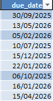
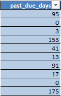
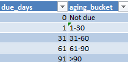
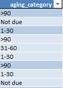
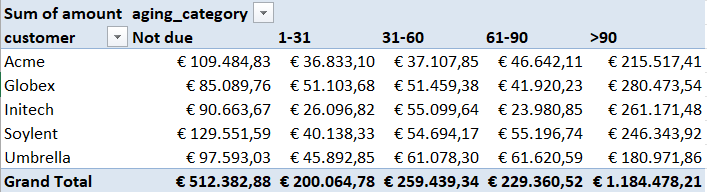
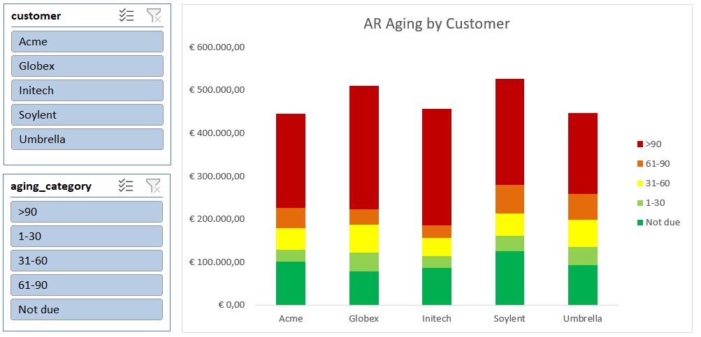

### Account Receivable (AR) Aging Report
This project involves calculating and categorizing AR aging and visualizing it into charts. It helps in identifying overdue payments and assessing the financial health of the company.

### Project Overview
This project demonstrates how to create an AR aging report using Excel. The report categorizes outstanding invoices based on their due dates and visualize it. 

📌 Tools used: Microsoft Excel

📌 Skills demonstrated: IF functions, VLOOKUP, pivot tables, data visualization with charts

### 🎯 Objectives
- Calculate AR aging based on invoice due dates
- Categorize outstanding invoices into aging buckets (e.g., not due, 1-30 days, 31-60 days, etc.)
- Visualize the AR aging distribution using charts
- Identify overdue payments and assess the financial health of the company

---

The original dataset contains 5 columns with the following features:
AR_id, Customers name, Invoice date, Due date, Amount.

### Steps:
1. **Calculate Due Date**: Ensure that the due date column is in date format. Then, use formula to calculate the due date based on the invoice date and payment terms (in this case 30): `=WORKDAY(AR_age_category!$C2;$J$1)`

I used the `WORKDAY` function to calculate the due date, which excludes weekends and holidays.

2. **Calculate Past Due Days**: Create a new column to calculate the number of days past due using the formula: `=IF([@[due_date]]>=TODAY();0;NETWORKDAYS([@[due_date]];TODAY()))`

I used the `NETWORKDAYS` function to calculate the number of working days past due, which excludes weekends and holidays.

3. **Create AR aging buckets table**: Create a new table to categorize the past due days into aging buckets.

4. **Categorize AR aging**: Use the `VLOOKUP` function to categorize the past due days into aging buckets based on the table created in step 3: `=VLOOKUP(AR_age_category!$F2;aging_bucket[#All];2)`

5. **Create Pivot Table**: Create a pivot table to summarize the total amount in each aging bucket.

6. **Visualize AR aging distribution**: Create a chart.

In this case I chose a stacked chart and slicer to filter by customer name and aging category.

7. **Create Dashboard**: Arrange the pivot table, chart, and slicer in a dashboard layout for easy analysis.

 

### Conclusion
By following these steps, you can create an AR aging report that helps in identifying overdue payments and assessing the financial health of the company. The visualizations provide insights into the distribution of outstanding invoices across different aging buckets, allowing for better decision-making and cash flow management.

According to this project

