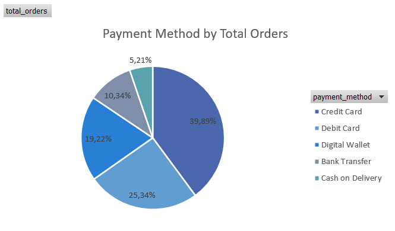
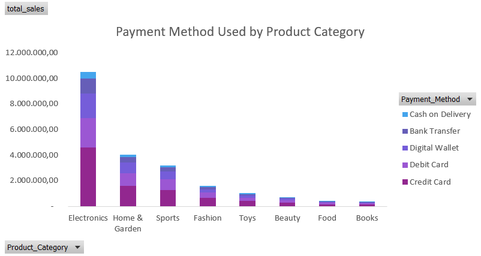
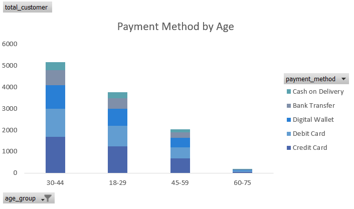
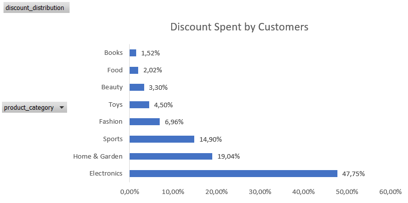
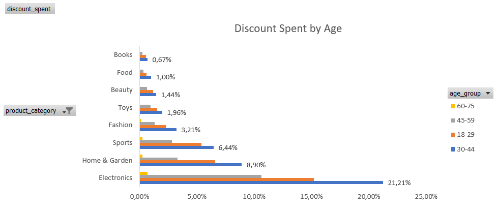

# Turkish E-Commerce analysis

This comprehensive dataset contains **5,000 e-commerce transactions** from a Turkish online retail platform from January 2023 to March 2024.

### Project Overview
This project showcases Excel skills in data cleaning and preparation, as well as data visualization techniques to analyze e-commerce trends in Turkey.

📌 Tools used: Microsoft Excel
📌 Skills demonstrated: Data cleaning and preparation, Power Query, pivot tables, data visualization with charts and dashboard design

### 🎯 Objectives
- Customer Demographics Distribution
- Geographical Sales Analysis
- Product Category Performance
- Payment and Device Analysis
- Discount Analysis
- Customer Behavior
- Post-Purchase Satisfaction
- Seasonal Sales Trends

---

The dataset contains **18 columns** with the following features:

### Order Information
- **Order_ID**: Unique identifier for each order (ORD_XXXXXX format)
- **Date**: Transaction date (2023-01-01 to 2024-03-26)

### Customer Demographics
- **Customer_ID**: Unique customer identifier (CUST_XXXXX format)
- **Age**: Customer age (18-75 years)
- **Gender**: Customer gender (Male, Female, Other)
- **City**: Customer city (10 major Turkish cities)

### Product Information
- **Product_Category**: 8 categories (Electronics, Fashion, Home & Garden, Sports, Books, Beauty, Toys, Food)
- **Unit_Price**: Price per unit (in TRY/Turkish Lira)
- **Quantity**: Number of units purchased (1-5)

### Transaction Details
- **Discount_Amount**: Discount applied (if any)
- **Total_Amount**: Final transaction amount after discount
- **Total_Price**: Total price for all items purchased before discount
- **Discount_Percentage**: Percentage of discount applied (0-50%)
- **Total_Discount_Amount**: Total discount amount applied
- **Payment_Method**: Payment method used (5 types)

### Customer Behavior Metrics
- **Device_Type**: Device used for purchase (Mobile, Desktop, Tablet)
- **Session_Duration_Minutes**: Time spent on website (1-120 minutes)
- **Pages_Viewed**: Number of pages viewed during session (1-50)
- **Is_Returning_Customer**: Whether customer has purchased before (True/False)

### Post-Purchase Metrics
- **Delivery_Time_Days**: Delivery duration (1-30 days)
- **Customer_Rating**: Customer satisfaction rating (1-5 stars)
---

### 🧹 Data Cleaning & Preparation

Before analysis, I performed several data-cleaning steps in Power Query:
- Removed duplicates and blank rows
- Removed unnecessary spaces
- Standardized text formatting
- Converted data types
- Created helper columns to support calculations (e.g., Total_Price, Discount_Percentage)

---

### 📊 Data Visualization & Analysis
### 👥 Customer Demographics Distribution

**Gender Distribution**

This e-commerce platform is dominated by female customers.

**Age Group Distribution**

The majority of customers are between 25-34 years old, followed by 35-44 years old.

**Age Group by Gender**

The majority of customers in all age groups are female.

**Total Customers by City**

Istanbul has the highest number of customers, followed by Ankara and Izmir.

### 📍 Geographical Sales Analysis

**Sales by City**

Istanbul leads in sales, amounting to 5,646,595.78 TRY, followed by Ankara and Izmir.

**Total Orders by City**

Istanbul has the highest number of orders, followed by Ankara and Izmir. Some orders may come from returning customers.

Based on the charts, the number of orders is directly proportional to sales amount.

### 🛍️ Product Category Performance
**Sales by Product Category**

Electronics is the top-selling product category, followed by Fashion and Home & Garden.

**Number of Orders by Product Category**

The Sports category has the highest number of orders, followed by beauty and books. This indicates that while Sports products are purchased more frequently, but in terms of price, Sports item are generally lower priced compared to Electronics items.
Thus, Electronics leads in total sales amount.

### 💳 Payment and Device Analysis
**Payment Method by Total Orders**

Credit cards are the most preferred payment method, followed by debit cards and digital wallets.

**Payment Method by Total Sales Amount**

Credit cards contribute the highest sales amount, followed by debit cards and digital wallets.

**Payment Method by Product Category**

Customers prefer to use credit cards for transactions across all product categories, followed by debit cards and digital wallets. This aligns with their contribution to sales.

**Payment Method by Age**

Credit cards are the most preffered payment method accross all age groups, followed by debit cards and digital wallets.

**Device Used**

Mobile devices are the most commonly used for purchases, followed by desktops and tablets.

### 💸 Discount Analysis
**Discounts by Product Category**

Customers spent the most on discounts in the Electronics category, followed by Fashion and Home & Garden.
Electronics also contributed in the highest sales amount after discounts. That indicates discount strategy is effective in boosting sales for this category.

**Discounts by Age Group**

Age group 30-44 spent the most discount on every category, followed by age group 18-29.

