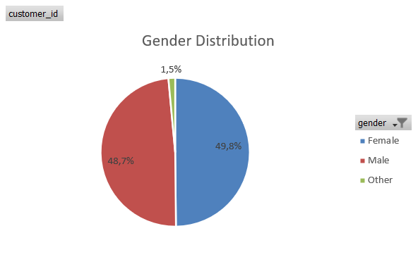
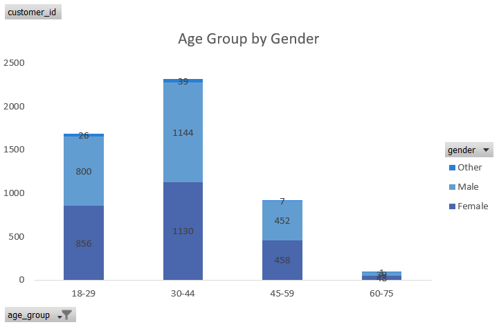
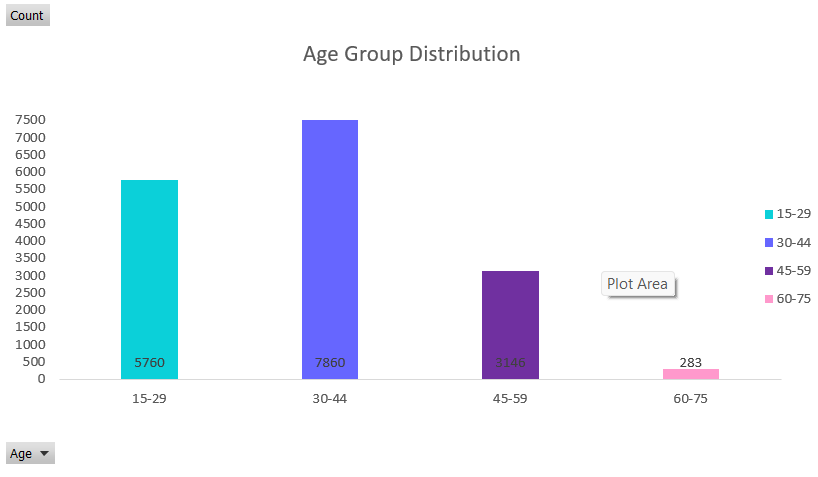
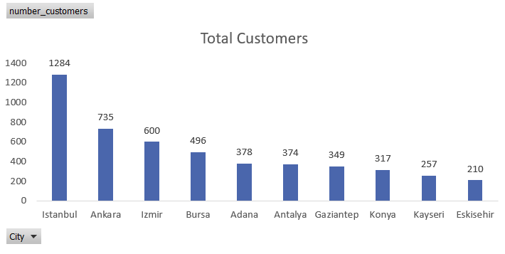
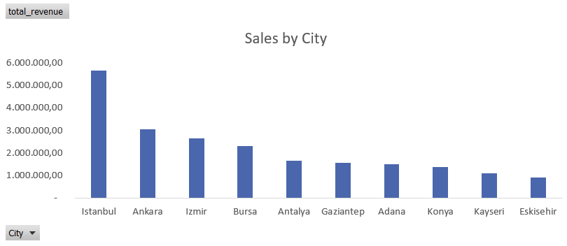
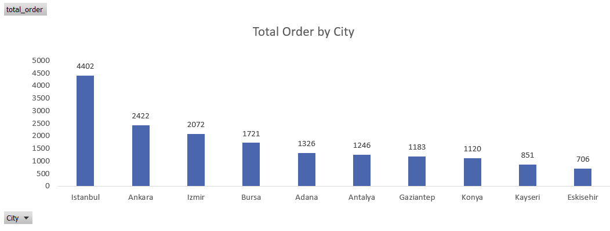
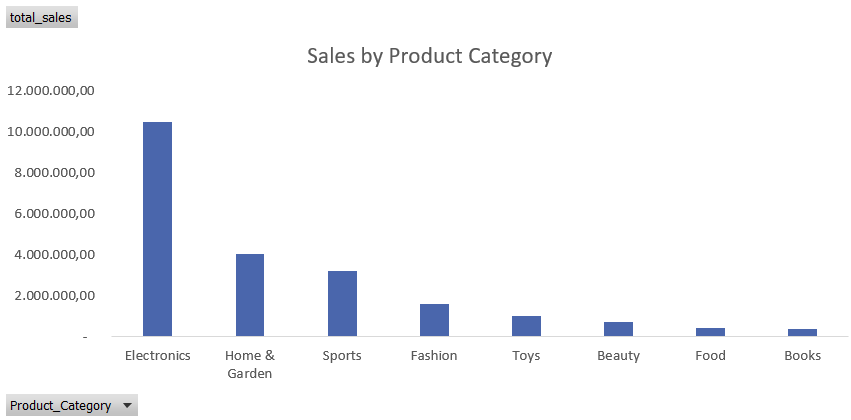
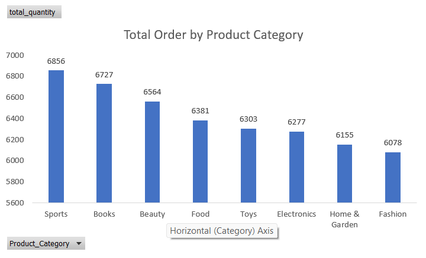
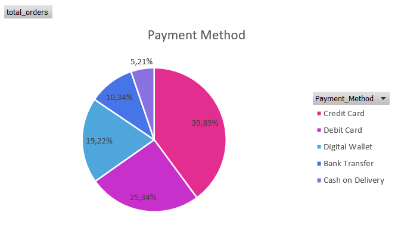
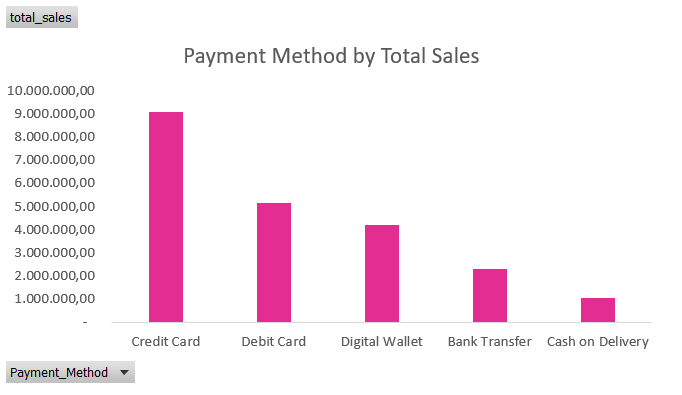

# Turkish E-Commerce analysis

This comprehensive dataset contains **5,000 e-commerce transactions** from a Turkish online retail platform from January 2023 to March 2024.

### Project Overview
This project showcases excel skills in data cleaning and preparation, as well as data visualization techniques to analyze e-commerce trends in Turkey.

📌 Tools used: Microsoft Excel\
📌 Skills demonstrated: Data Cleaning and preparation, power query, pivot tables, data vizualization with charts and dashboard design

### 🎯 Objectives
- Customer Demographics Distribution
- Geographical Sales Analysis
- Product Category Performance
- Payment and Device Analysis
- Discount Analysis
- Customer Behavior
- Post-Purchase Satisfaction
- Seasonal Sales Trends

---

The dataset contains **18 columns** with the following features:

### Order Information
- **Order_ID**: Unique identifier for each order (ORD_XXXXXX format)
- **Date**: Transaction date (2023-01-01 to 2024-03-26)

### Customer Demographics
- **Customer_ID**: Unique customer identifier (CUST_XXXXX format)
- **Age**: Customer age (18-75 years)
- **Gender**: Customer gender (Male, Female, Other)
- **City**: Customer city (10 major Turkish cities)

### Product Information
- **Product_Category**: 8 categories (Electronics, Fashion, Home & Garden, Sports, Books, Beauty, Toys, Food)
- **Unit_Price**: Price per unit (in TRY/Turkish Lira)
- **Quantity**: Number of units purchased (1-5)

### Transaction Details
- **Discount_Amount**: Discount applied (if any)
- **Total_Amount**: Final transaction amount after discount
- **Total_Price**: Total price for all items purchased before discount
- **Discount_Percentage**: Percentage of discount applied (0-50%)
- **Total_Discount_Amount**: Total discount amount applied
- **Payment_Method**: Payment method used (5 types)

### Customer Behavior Metrics
- **Device_Type**: Device used for purchase (Mobile, Desktop, Tablet)
- **Session_Duration_Minutes**: Time spent on website (1-120 minutes)
- **Pages_Viewed**: Number of pages viewed during session (1-50)
- **Is_Returning_Customer**: Whether customer has purchased before (True/False)

### Post-Purchase Metrics
- **Delivery_Time_Days**: Delivery duration (1-30 days)
- **Customer_Rating**: Customer satisfaction rating (1-5 stars)
---

### 🧹 Data Cleaning & Preparation

Before analysis, I performed several data-cleaning steps in power query:
- Removed duplicates and blank rows
- Removed unnecessary spaces
- Standardized text formatting
- Converted data types 
- Created helper columns to support calculations (e.g., Total_Price, Discount_Percentage)

---

### 📊 Data Visualization & Analysis
### 👥 Customer Demographics Distribution

**Gender Distribution**

This e-commerce platform is dominated by female customers.

**Age Group Distribution**

Majority of customers are between 25-34 years old, followed by 35-44 years old.

**Total Customers by City**

Istanbul has the highest number of customers, followed by Ankara and Izmir.

### 📍 Geographical Sales Analysis

**Sales by City**

Istanbul leads in sales amounted 5.646.595,78 TRY, followed by Ankara and Izmir.

**Total Order by City**

Istanbul has the highest number of orders, followed by Ankara and Izmir. Some of the orders
may come from returning customers.

Based on the charts conclude that number of orders is directly proportional to sales amount.

### 🛍️ Product Category Performance
**Sales by Product Category**

Electronics is the top-selling product category, followed by Fashion and Home & Garden.

**Number of Orders by Product Category**

Sports category has the highest number of orders, followed by Electronics and Fashion.
This indicates that while Electronics generates the most revenue, Sports products are purchased more frequently.
As of price-wise, Electronics items are generally higher in price compared to Sports items.

### 💳 Payment and Device Analysis
**Payment Method Distribution**

Credit card is the most preferred payment method, followed by debit card and digital wallets.

**Payment Method Distribution by Total Sales Amount**

Credit card contributes the highest sales amount, followed by debit card and digital wallets.

**Payment Method Distribution by Product Category**

